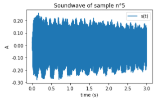
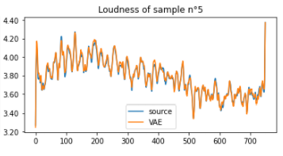
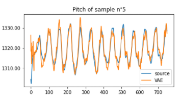
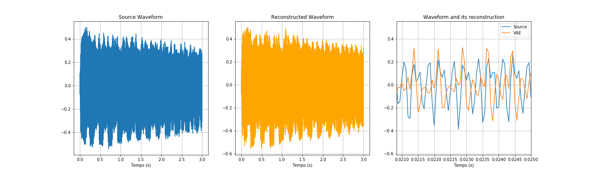
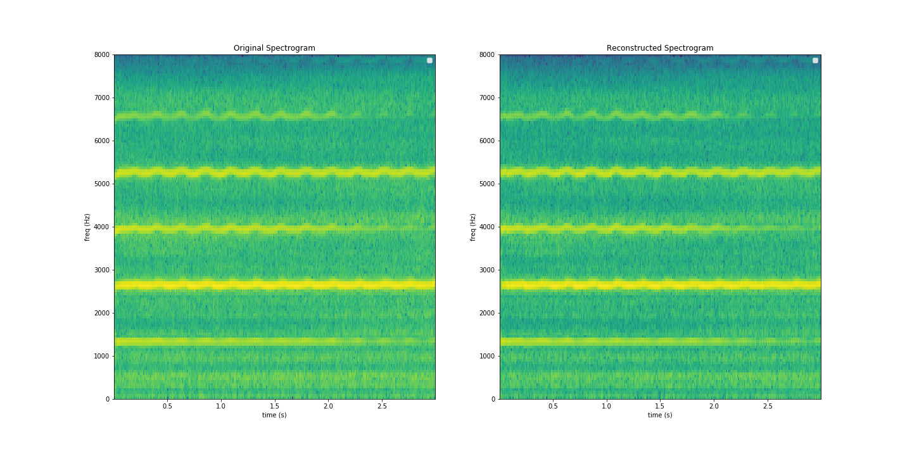
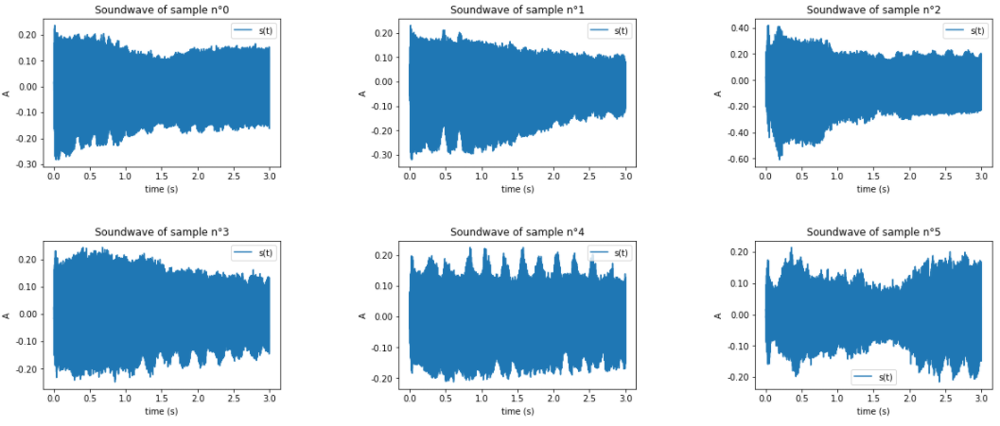
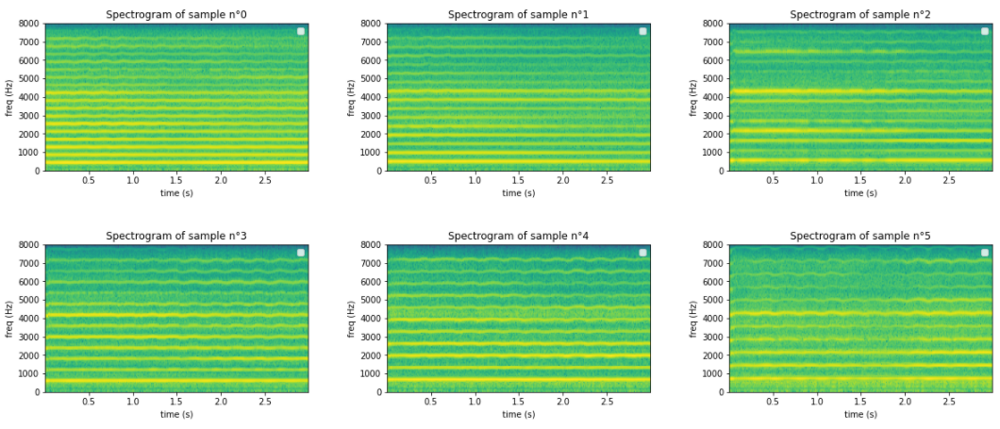

# Visualization and Listening

### Audio of sample n°5

<audio controls>
  <source src="samples/sample_source_5.mp3" type="audio/mp3">
Your browser does not support the audio element.
</audio>

### Soundwave and Spectrogramme of sample n°5

    
### Source loudness and its reconstruction for sample n°5

### Source pitch and its reconstruction for sample n°5

### Comparison of Source and Reconstructed Waveform of sample n°5

### Comparison of Source and Reconstructed Spectrogram of sample n°5

#### With a pre-trained DDSP model, we are able to reconstruct a wav file from the loudness and the pitch

### Audio of sample n°5

<audio controls>
  <source src="samples/sample_source_5.mp3" type="audio/mp3">
Your browser does not support the audio element.
</audio>

### Reconstructed audio of sample n°5

<audio controls>
  <source src="samples/Audio_Recon.mp3" type="audio/mp3">
Your browser does not support the audio element.
</audio>

## Interpolation

### Generation of 6 samples 

<audio controls>
  <source src="samples/Interp_lambda=0.0.mp3" type="audio/mp3">
Your browser does not support the audio element.
</audio>

<audio controls>
  <source src="samples/Interp_lambda=0.2.mp3" type="audio/mp3">
Your browser does not support the audio element.
</audio>

<audio controls>
  <source src="samples/Interp_lambda=0.4.mp3" type="audio/mp3">
Your browser does not support the audio element.
</audio>

<audio controls>
  <source src="samples/Interp_lambda=0.6.mp3" type="audio/mp3">
Your browser does not support the audio element.
</audio>

<audio controls>
  <source src="samples/Interp_lambda=0.8.mp3" type="audio/mp3">
Your browser does not support the audio element.
</audio>

<audio controls>
  <source src="samples/Interp_lambda=1.0.mp3" type="audio/mp3">
Your browser does not support the audio element.
</audio>

### Soundwaves of the generated samples

### Spectrograms of the generated samples

