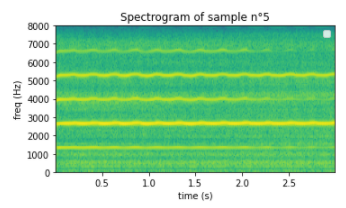

# DDSP

link to try it directly : 
https://jeremybboy.github.io/DDSP/

     
### Source loudness and its reconstruction for sample n°5

### Source pitch and its reconstruction for sample n°5

### Soundwave and Spectrogramme of sample n°5

### Audio of sample n°5
<audio controls="controls">
  <source type="audio/mp3" src="/samples/sample_source_5.mp3"></source>
  <source type="audio/wav" src="/samples/sample_source_5.wav"></source>
  
Your browser does not support the audio element.

</audio>

